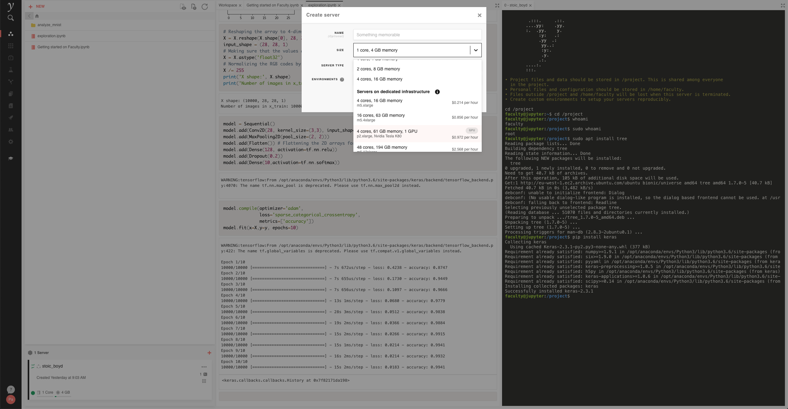

.. Chest Data Warehouse documentation master file, created by
   sphinx-quickstart on Wed Apr  1 20:03:09 2020.
   You can adapt this file completely to your liking, but it should at least
   contain the root `toctree` directive.

National COVID-19 Chest Image Database (NCCID)
==============================================

The chest image database aims to make available chest X-rays and CT
scans to software developers and academics to test and develop AI
models.

Instructions for data collection sites
--------------------------------------

If you are interested contributing to this dataset, please
`get in touch here <https://medphys.royalsurrey.nhs.uk/nccid/index.php>`_!

Requesting access
-----------------

Users (software vendors, academics, clinicians…) requiring access to
the database should fill in `this form <https://docs.google.com/document/d/1LZXvGuSvc5661wKuHFem3ckKravvqth6nnGHmsTp_Y4/edit#>`_
and send it to NHSX by contacting imaging@nhsx.nhs.uk.

What the data can be used for
-----------------------------

This project aims to produce improvements in healthcare delivery for
COVID-19 patients by creating a national resource for chest imaging
research.

The research enabled by the chest imaging database will provide
information and tools that, in the context of the COVID-19 pandemic,
support:

- The determination of disease severity
- Clinically useful diagnosis and prognosis
- Patient triage and management
- Decision making

We expect the data will be used to:

- Develop image processing software. *Example*: An AI model that
  determines COVID-19 risk score from chest X-rays.
- Mathematical Modelling. *Example*: A mathematical model that
  utilises chest X-rays to determine which patients in A&E will
  need a ventilator during their subsequent hospital stay.
- Validation of AI products. *Example*: A study to determine the extent
  to which an AI model for the diagnosis of COVID-19 trained on non-UK
  data retains its performance when applied on data from UK patients.
- Teaching resource for radiologists. *Example*: A teaching environment
  for radiologists where learners are presented with chest images,
  requested to diagnose COVID-19 cases, and receive feedback on their input.

How requests are assessed
-------------------------

Access requests will be assessed by a committee of experts from NHSX
and the British Society of Thoracic Imaging (BSTI) including:

- A scientific advisor
- A technology advisor
- An information-governance advisor
- A patient/ethics advisor
- A system advisor to evaluate the positive impact to the NHS overall
- An administrator to manage the access requests

Decisions will be guided by the following criteria:

- Scientific merit of the proposed work
- Compliance with GDPR and NHS standards of information governance
- Reasonable evidence that access to the data can benefit patients and NHS staff
- The track record and expertise of the applicants

Applications are subject to external peer review if deemed proportionate
and where the necessary expertise is not available within the committee.

Please note that:

- Data access is subject to a sharing agreement between the applicant
  and NHSX, for teaching, research and software development/validation
  purposes that address the COVID-19 pandemic.
- Data will be made accessible to external entities to undertake specific
  research projects to address needs in the detection and stratification
  of COVID-19 that will benefit from combined clinical and imaging data.
  Any access to the data and licences to use will be limited to tools developed
  to support the COVID-19 pandemic, and will cease when the COVID-19 COPI
  (COVID-19 – Notice under Regulation 3(4) of the Health Service Control of
  Patient Information Regulations 2002) ceases effect.

Accessing data
--------------

The data is stored in `Amazon S3 <https://aws.amazon.com/s3/>`_. Once
your organisation has been granted access, NHSX will send AWS
credentials by encrypted email. The credentials will allow accessing
the data. We recommend accessing the data using a client. For
instance, to access data from Python, we recommend using `Boto3
<https://boto3.amazonaws.com/v1/documentation/api/latest/index.html>`_:

.. code::

    import boto3

    s3 = boto3.resource('s3')
    BUCKET_NAME = 'chest-data-warehouse'

    bucket = s3.Bucket(BUCKET_NAME)
    print(list(bucket.objects.filter(Prefix='training/')))

The data is structured as follows:

- ``/training/<patient_id>/images/<date>/<image_id>.dcm`` contains images for a
  particular patient, uploaded at a particular date. The patient ID is
  pseudonymized.
- ``/training/<patient_id>/images_metadata/<date>/<image_id>.json`` contains the DICOM
  tags for the the image. We recommend using this, instead of the plain DICOM image,
  to retrieve the tags, since it will be a much smaller file.
- ``/training/<patient_id>/data/<date>/data.json`` contains patient clinical data as it
  was known on ``<date>``. Each file will supersede files written at previous dates.

.. TODO sample code to retrieve all data prior to a particular date.
.. TODO sample code to retrieve all data for a particular patient

Model development
-----------------

AI developers and researchers who have been granted access to the data
warehouse are welcome to download the images and use them on their own
site if they have existing technology.

Faculty is also making `Faculty Platform
<https://docs.faculty.ai>`_, our data science
workbench, available to developers. Users of Faculty Platform will
have access to an environment where they can access the images, as
well as significant compute resources: GPU servers, or servers with a
lot of memory.

.. TODO how to access platform?
