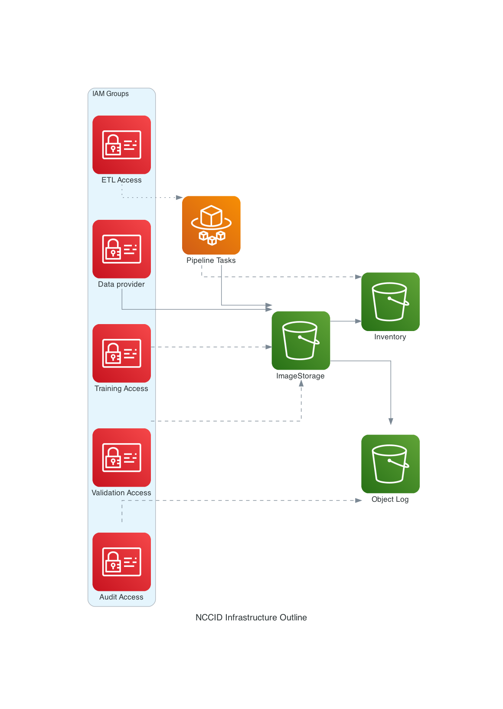

# Infrastructure

This folder contains the relevant infrastructure setup for the
NCCID warehouse and processing pipeline:

The `templates` folder hosts the [CloudFormation](https://aws.amazon.com/cloudformation/)
templates, while the Python scripts are used for applying those templates.

The `tools` folder hosts some practical tools to interact with the infrastructure
in various ways, [see what's included](tools/README.md).

For the internal dashboard infrastructure, check [here](../infrastructure-dashboard/README.md).

## Warehouse

The docs previews for this repository are stored in an S3 bucket,
which is created from the [`warehouse.yaml`](templates/warehouse.yaml)
template.

```shell
$ ./create.py --help
INFO:botocore.credentials:Found credentials in environment variables.
usage: create.py [-h] [-s SUFFIX]

optional arguments:
  -h, --help            show this help message and exit
  -s SUFFIX, --suffix SUFFIX
                        suffix to use for templates and names
```

The (simplified) infrastructure of the warehouse outline in the diagram below.
Solid arrows mean data flow or write access, dashed lines mean read-only access,
dotted line means logical connection between items.



To regenerate the above graphics, run `diagram.py`.

### Container

The [`container`](./container) folder contains the source code of the
Docker image, in which the warehouse pipeline tasks are all run.

## Docs Preview

The docs previews for this repository are stored in an S3 bucket,
which is created from the [`docs-preview.yaml`](templates/docs-preview.yaml)
template. Use the `docs-preview.py` script (with the AWS credentials set
in the environment) to create or update the CloudFormation stack

```shell
$ ./docs-preview.py --help
INFO:botocore.credentials:Found credentials in environment variables.
usage: docs-preview.py [-h] [-b BUCKET]

optional arguments:
  -h, --help            show this help message and exit
  -b BUCKET, --bucket BUCKET
                        The docs preview bucket's name
```

The Preview workflow uses this bucket. You need to create an AWS programmatic
user, add it to the relevant `docs-preview-....-DocsPreviewUploaderGroup-...` group.
Finally, you need to set these GitHub Secrets:

* `AWS_DOCS_PREVIEW_BUCKET`: the name of the bucket, such as `nhsx-covid-chest-imaging-database-preview`
* `AWS_DOCS_PREVIEW_BUCKET_REGION`: the region of the bucket, such as `eu-west-2`
* `AWS_KEY_ID`: credential ID for the relevant AWS user created for the GitHub Action
* `AWS_SECRET_ACCESS_KEY`: credential value for the relevant AWS user created for the GitHub Action

## Current infrastructure

The high-level overview of AWS infrastructure that external users might interact with:

* S3 Buckets:
  * `nccid-data-warehouse-prod` is the main warehouse storage (similar buckets for development and staging as well), authenticated access
  * `nccid-data-warehouse-prod-processed` stores the preprocessed aggregated data for internal and external dashboards (also similar buckets for development and staging), limited authenticated access
  * `nhsx-covid-chest-imaging-database-preview` is used for database previews generated by the relevant GitHub action (this bucket is public access)

For other parts of the infrastructure, check the templates in this folder for overview, or the deployed CloudFormation stacks for actual created resources.
