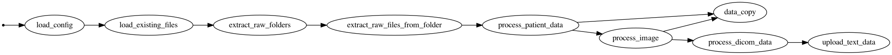

# Warehouse Loading

Pipeline for processing incoming images and patient data files in the data warehouse.

This pipeline takes care of appropriate preprocessing of the image data, create
the data warehouse file layout, and split the appropriate training and validation (holdout)
sets based on patient IDs.

## Running the code

Install the required dependencies:

```shell
pip install -r requirements.txt
```

Ensure that relevant AWS credentials are exported to the shell where the script is running.
Set the working S3 bucket name with the `BUCKET_NAME` environment variable

```shell
export BUCKET_NAME=my-warehouse-bucket
```

then run the script directly with the [bonobo](https://www.bonobo-project.org/)
CLI (installed as part of the requirements):

```shell
bonobo run warehouse/warehouseloader.py
```

The results of the pipeline will be shown in the terminal, for example:

```shell
$ bonobo run warehouse/warehouseloader.py --env WAREHOUSE_BUCKET=my-warehouse-bucket
- load_config in=1 out=1 [done]
- load_existing_files in=1 out=1 [done]
- extract_raw_folders in=1 out=5 [done]
- extract_raw_files_from_folder in=5 out=56294 [done]
- process_patient_data in=56294 out=56294 [done]
- process_image in=56294 out=111835 err=2 [done]
- process_dicom_data in=111835 out=55916 [done]
- upload_text_data in=55916 out=55916 [done]
- data_copy in=168129 out=56243 [done]
 ```

To run the code, have have AWS programmatic access credentials loaded in the environment
for a user that is a member of the relevant ETLGroup IAM group.

## Warehouse / Pipeline configuration

The pipeline is configured with a `config.json` placed at the apex of the relevant bucket.
A [sample file](config.json.template) is provided, and generally requires the following
pieces of information filled in:

* `raw_prefixes` (list): the list of raw prefixes in the bucket that are allowed to be processed. These
  are the folders where the raw file uploads happen, and generally have names in the pattern of
  `raw-<aws-username>`
* `training_percentage` (int): the percentage (0-100) of the patients to split into the training group.
* `sites`: this setting has 3 sub-sections, each containing a list of sites that are matched against
  the medical data files' `SubmittingCentre` section, to define the data splitting behaviour
  * `split` (list): sites that are randomly split between training/validation, in a proportion set by
    the `training_percentage` value above
  * `training` (list): all patients going to the training set
  * `validation` (list): all patients going to the validation set

This configuration file has to be present at the root of the given S3 bucket.
## Pipeline overview

The data loader pipeline follows these steps (referring to the specific Python
functions in the code):



It translates to:

* Load the warehouse configuration.
* Extract the raw files (clinical and images) that potentially need processing. That
  means first all clinical files, then after them the image files that is seen to
  need processing (ie. no corresponding files in the processed side of the warehouse).
* Run those files through the patient data processing (which only does something
  with them if they are clinical data), and potentially copy clinical data files
  to a new location as required. This generates the training/validation split information
  as well, if for a patient/pseudonym it hasn't been done yet.
* Run the files through the image processing (which only does something with them
  if they are image files, ie. `.dcm`). This chaining ensures that the clinical files
  are always processed before the image files, ensuring that there's available training/validation
  split information for the given pseudonym, extracted from the image's DICOM headers
* If images need copied, they are passed on to that step, and DICOM metadata is extracted
  and uploaded.

To generate the pipeline flow above, install the Python dependencies, [Graphviz](https://www.graphviz.org/), and run:

```shell
bonobo inspect --graph warehouse/warehouseloader.py | dot -o warehouseloader-pipeline.png -T png
```

## Warehouse structure

The warehouse training data is organised into subfolders based on image types, patient ID,
and date, as follows:

```shell
/training/ct/PATIENT_ID/STUDY_UID/SERIES_UUID/IMAGE_UUID.dcm
/training/ct-metadata/PATIENT_ID/STUDY_UID/SERIES_UID/IMAGE_UUID.json
/training/mri/PATIENT_ID/STUDY_UID/SERIES_UID/IMAGE_UUID.dcm
/training/mri-metadata/PATIENT_ID/STUDY_UID/SERIES_UID/IMAGE_UUID.json
/training/xray/PATIENT_ID/STUDY_UID/SERIES_UID/IMAGE_UUID.dcm
/training/xray-metadata/PATIENT_ID/STUDY_UID/SERIES_UID/IMAGE_UUID.json
/training/data/PATIENT_ID/status_DATE.json
/training/data/PATIENT_ID/data_DATE.json
```

* The `ct`, `mri`, `xray` folders hold the DICOM images of the relevant kind.
* Subfolders within those are organized by the extracted Study Instance UID
  (unique identifier) and Series Instance UID values of the images.
* The `...-metadata` folders hold the DICOM tags exported as `json` from the
  corresponding `IMAGE_UUID.dcm`.
* The `data` folder holds the patient medical data, `status_DATE.json` files for
  negative results, and `data_DATE.json` file/files for positive results. The `DATE` is
  formatted as `YYYY-MM-DD`, such as `2020-04-21`.

## Extracting submitting centre values

As mentioned above, the pipeline configuration requires a list of hospitals
that are assigned to the `split`/`training`/`validation` sets. To extract
the current values from the submitted data, run the `submittingcentres` pipeline,
which will print the list of hospitals in the console:

```shell
$ bonobo run warehouse/submittingcentres.py --env WAREHOUSE_BUCKET=mybucketname
ACME Hospital
Busytown Hospital
 - load_config in=1 out=1 [done]
 - extract_raw_folders in=1 out=2 [done]
 - extract_raw_files_from_folder in=2 out=3042 [done]
 - SubmittingCentreExtractor in=3042 [done]
```


```shell
bonobo inspect --graph warehouse/submittingcentres.py | dot -o submittingcentres-pipeline.png -T png
```


## Preprocessing data in the warehouse

There are internal (see [`dashboard/dashboard/README.md`](../dashboard/dashboard/README.md))
and external dashboards (see [`docs/dashboard/README.md`](../docs/README.md)), which are based
on information in the warehouse. To power those dashboards, a data preprocessing pipeline
does the number-crunching and creates summary files to be used.

The data processing pipeline runs similarly to the other cases as before:

```shell
$ bonobo run warehouse/dataprocess.py --env WAREHOUSE_BUCKET=mybucketname
- list_clinical_files in=1 out=1317 [done]
- load_clinical_files in=1317 out=1317 [done]
- list_image_metadata_files in=1 out=3767 [done]
- load_image_metadata_files in=3767 out=3767 [done]
- get_storage_stats in=1 out=1 [done]
- DataExtractor in=5084 [done]
```

with the following flow:


* The clinical files, images (image metadata), and storage information is extracted in parallel.
* All are combined at the end, and uploaded to an "processed" S3 blucket
  (to `<WAREHOUSE_BUCKET>-processed` where the value of `<WAREHOUSE_BUCKET>` is from the environment
  variables)

To generate the pipeline flow above, install the Python dependencies, [Graphviz](https://www.graphviz.org/), and run:

```shell
bonobo inspect --graph warehouse/dataprocess.py | dot -o dataprocess-pipeline.png -T png
```

## Running in AWS

Normally these pipelines are run in AWS, following these steps:

* Log in to AWS, assume the relevant user role you need
* Navigate to the **Elastic Compute Cloud** section
* Select the relevant Cluster to run things on (e.g. "...-dev",
  "...-staging" or "...-prod" cluster for the different stacks)
* In the Cluster control panel, select **Tasks**, and **Run new Task**
* Set the following values across the task setup:
  * **Launch type**: Fargate
  * **Task definition**: the relevant task definition for the given stack/cluster
    (eg. `warehouse-staging-Pipeline`, or `warehouse-prod-SubmittingCentres`, etc).
    `...-Pipeline` is the loading pipeline's task, `...-SubmittingCentres` is the submitting
    centre extractor, and `...-DataProcessing` is the preprocessing step for the dashboards
  * **Platform version**: select `1.4.0`
  * **Cluster VPC**: select the VPC that is in the given cluster, which you can do
    by hovering on the VPC value, and the hover text will show the name,
    e.g. `nccid-data-warehouse-prod-VPC`. Make sure that the stack value (e.g. `prod` here)
    is for the correct cluster/task.
  * **Subnets**: select at least 1 (but recommended to be be both available) subnets. Here also
    check that the subnet's name (e.g. `nccid-data-warehouse-prod-publicA`) has the same stack
    value as the rest of the setup.
  * **Security Group**: hit `edit`, then `Select existing security group` and select the one
    `warehouse-...-Fargate-...` security group in the list, then `Save`
  * **Auto-assign public IP**: set to `ENABLED` (without this, the task won't be able to pull
    the relevant Docker image to run on).
* After the required values above, can check the optional values / cross-check:
  * **Advanced options** / **Container overrides** / **pipeline**: check the prefilled values
    of the `Command override`, an `Environment variable overrides` sections. Make sure the
    command corresponds to the pipeline you expect (from the `bin/` folder of the library,
    and change any of the env vars that you might need. `COMMIT` is likely the only one you
    would ever need to change (if you want to run the pipeline from a Pull Request or similar).

Once done, hit `Run task`, wait for it to be provisioned, then follow the logs, or the metrics
in CloudWatch.

## Logs and monitoring

You can monitor the logs in the running task, or can find the logs of a given run later on
in **CloudWatch** / **Logs** / **Log groups** and the relevant `/ecs/warehouse-<stack>-pipeline`
log group. You can also use [`infrastructure/tools/get_logs.py`](../infrastructure/tools/get_logs.py) to download a log
stream (one run) into a local JSON file, including all log fragments (run the script with `-h`
to see the options available.)

For resource metrics and monitoring, you can visit **CloudWatch** / **Container Insights**. When the
task is running for a few few minutes, it will show up in **Resources** and can be selected for monitoring.
Or using **Performance Monitoring** within Container Insights, do the filtering yourself, when the metrics
start to flow.

## Development and testing

The loader pipelines come with extensive tests, and you can run those by installing
`tox` (through `pip install tox`), and then running (with a Python 3.6 environment
being available, as the pipeline is running on that):

```shell
tox -e py36
```

The tests are included in the `tests/` folder, and comprise both unit and integration
tests, mocking the Cloud resources as needed. See those files for more information
on what's being tested. See [`pytest`](https://docs.pytest.org/en/stable/) for available
flags for these test runs.

When changes are made to the pipeline files, can do the formatting and checking steps
(using `isort`, `black`, and `flake8`) by running:

```shell
tox -e prepare
```

To see what happens when running these, check the `tox.ini` configuration.
