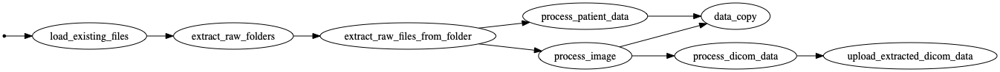

# Warehouse Loading

Pipeline for processing incoming images and patient data files in the data warehouse.

This pipeline takes care of appropriate preprocessing of the image data, create
the data warehouse file layout, and split the appropriate training and validation (holdout)
sets based on patient IDs.

## Running the code

Install the required dependencies:

```shell
pip install -r requirements.txt
```

Ensure that relevant AWS credentials are exported to the shell where the script is running.
Set the working S3 bucket name with the `BUCKET_NAME` environment variable

```shell
export BUCKET_NAME=my-warehouse-bucket
```

then run the script directly.

```shell
bonobo run warehouseloader.py
```

The results of the pipeline will be shown in the terminal, for example:

```shell
$ bonobo run warehouseloader.py --env WAREHOUSE_BUCKET=bucketname
- load_config in=1 out=1 [done]
- load_existing_files in=1 out=1 [done]
- extract_raw_folders in=1 out=3 [done]
- extract_raw_files_from_folder in=3 out=55957 [done]
- process_image in=55957 out=111782 err=2 [done]
- process_dicom_data in=111782 out=55891 [done]
- upload_text_data in=55891 out=55891 [done]
- process_patient_data in=55957 out=61 [done]
- data_copy in=111843 out=55952 [done]
- SummaryFile in=111843 [done]
 ```

## Pipeline overview



To get this image, install the Python dependencies, [Graphviz](https://www.graphviz.org/), and run:

```shell
bonobo inspect --graph warehouseloader.py | dot -o warehouse-loader-pipeline.png -T png
```

## Warehouse structure

The warehouse training data is organised into subfolders based on image types, patient ID,
and date, as follows:

```shell
/training/ct/PATIENT_ID/IMAGE_UUID.dcm
/training/ct/summary.json
/training/ct-metadata/PATIENT_ID/IMAGE_UUID.json
/training/ct-metadata/summary.json
/training/mri/PATIENT_ID/IMAGE_UUID.dcm
/training/mri/summary.json
/training/mri-metadata/PATIENT_ID/IMAGE_UUID.json
/training/mri-metadata/summary.json
/training/x-ray/PATIENT_ID/IMAGE_UUID.dcm
/training/x-ray/summary.json
/training/x-ray-metadata/PATIENT_ID/IMAGE_UUID.json
/training/x-ray-metadata/summary.json
/training/data/PATIENT_ID/status_DATE.json
/training/data/PATIENT_ID/data_DATE.json
/training/data/summary.json
```

* The `ct`, `mri`, `x-ray` folders hold the DICOM images of the relevant kind.
* The `...-metadata` folders hold the DICOM tags exported as `json` from the corresponding `IMAGE_UUID.dcm`
* The `data` folder holds the patient medical data, `status_DATE.json` files for negative results, and `data_DATE.json` file/files for positive results. The `DATE` is formatted as `YYYY-MM-DD`, such as `2020-04-21`.
* Each of the `summary.json` files contain exported data that can help filtering files that you might want to download. The file's structure is:

```json
[
  {
    "patient_id": "PATIENT_ID",
    "modality": "ct",
    "file_name": "IMAGE_UUID.dcm",
    "file_key": "training/ct/PATIENT_ID/IMAGE_UUID.dcm",
    "upload_date": "DATE"
  },
  ...
]
```
